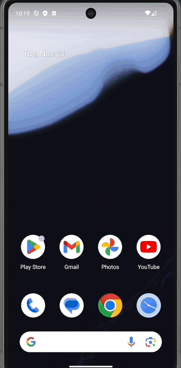

# MoviesSkell
Skeleton App to showcase MVVM Architectural patterns in Android.
## Project Description

* MVVM.
* Clean Code.
* DI with Koin.
* Android View System.
* Coroutines.
* DTO .
* LiveData.
* Navigation-component.
* Kotlin.
* Lottie Animations.
* Localized texts to facilitate the addition of new languages.
* Logs for easy debugging.
* Unit Tests.
## Features 

* Onboarding slides with Lottie animations (only during the first launch of the app).
* Display list of movies obtained from a public API.
* Pagination.
* Display movie detail.
* Error handling.

## Preview 

